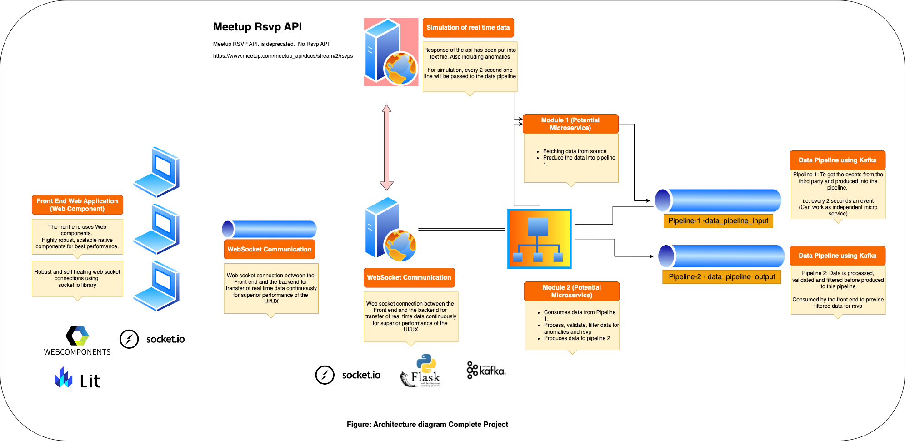

# Meet up Rsvp

<!-- Description - What this document is about -->
___

## Index

- [Architecture Diagram of Application](#architecture)
- [Best practices](#best-practices)
- [Resources Over Web](#resources)
- [To do list](#to-do)

___

## Architecture Diagram of Application

#### This application has following major components

1. Backend applicaiton (build upon Python and Flask)
2. Backend - Integration with Apache Kafka
3. Backend - Integrartion with Socket Library
4. Frontend application (build upon Webcomponents and Lit)
5. Frontend - Integration with Socket Library

---

## Best Practices

1. <!-- link/list the best practices related to this -->

---

## Resources Over Web

1. <!-- list of the resources over web -->

---

## To do list

1. <!-- list of the to do points about this document, till the document is not completed -->