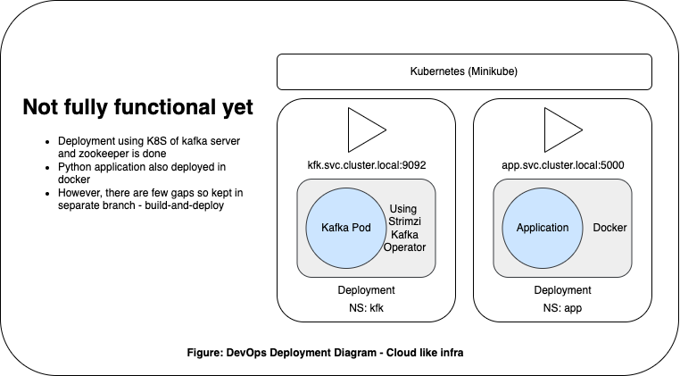

# Meet up Rsvp

<!-- Description - What this document is about -->
___

## Index

- [Architecture Diagram of Application](#architecture)
- [Build and Deploy Flow](#build)
- [File Structure](#file)
- [Assumptions for this MVP](#mvp)
- [To do list](#todo)

___


## Architecture Diagram of Application<a name="architecture"></a>

#### This application has following major components

1. Backend applicaiton (build upon Python and Flask)
2. Backend - Integration with Apache Kafka
3. Backend - Integrartion with Socket Library
4. Frontend application (build upon Webcomponents and Lit)
5. Frontend - Integration with Socket Library


---

## Build and Deploy Flow <a name="build"></a>

> Note: This one is not fully operational. So kept the solution in the separate branch

#### What has been done
1. Docker image of the backend Python
2. K8S setup using minikube
3. Spinning Kafka pod



---

## File structure<a name="file"></a>

> File structure for frond end application
```bash
|____frontendApp
| |____meetup-rsvp-fe
| | |____test
| | |____node_modules
| | |____index.js
| | |____custom-elements.json
| | |____README.md
| | |____stories
| | |____package-lock.json
| | |____package.json
| | |____web-dev-server.config.mjs
| | |____src
| | | |____MeetupRsvpFe.js
| | | |____services
```         
> File structure for backend applicaiton

```bash
____backendService
| |____mocks
| |____tests
| |____manifest.in
| |____flaskr
| | |____constants.py
| | |____data_pipeline_input.py
| | |____kafka_connector_service.py
| | |____data_validation_filteration.py
| | |____static
| | |____app.py
| | |____templates
| | |____data_pipeline_output.py
| | |____processorKafkaStream.py
| | |____data_pipeline_processor.py
| |____setup.py
```
> File structure for dev ops
```bash
# Removed for now
```

---

## Instructions and versions<a name="instructions"></a>

1. [For Backend Application](./backendService/README.md)
2. [For Frontend Application](./frontendApp/README.md)
3. [For Devops][./buildDeploy/README.md]

---

## Assumptions for this MVP<a name="mvp"></a>

1. Version controlling at local, as it was not supposed to be published.
2. As API from meetup and documentation are not available. While validation, processing, filtering. Some assumptions have been used.
3. No databse has been connected as one of two approaches. Destination-to-Destination is used. 
4. For build of backend project, haven't invested in separate complete build process. But for docker in docker file app can be installed by using configuration files. 
5. For front end, build less design is used as web component library has quite good performance. Only for acutal production deployment build is required. 
6. Functional testing is done, performance testing not completed
7. Test automation suites are included but few tests for showcasing capability are included.
  

---

## To do list<a name="todo"></a>

1. System is designed a way that it can be converted in micro-services design pattern but, at the moment it is one single application. 
2. Automation testing 
3. Threading can be improved by event handling. Not invested at the moment.
4. Complete CI/CD pipeline with cloud like environment.